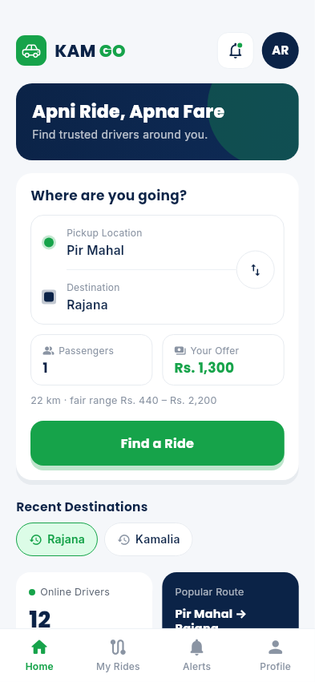
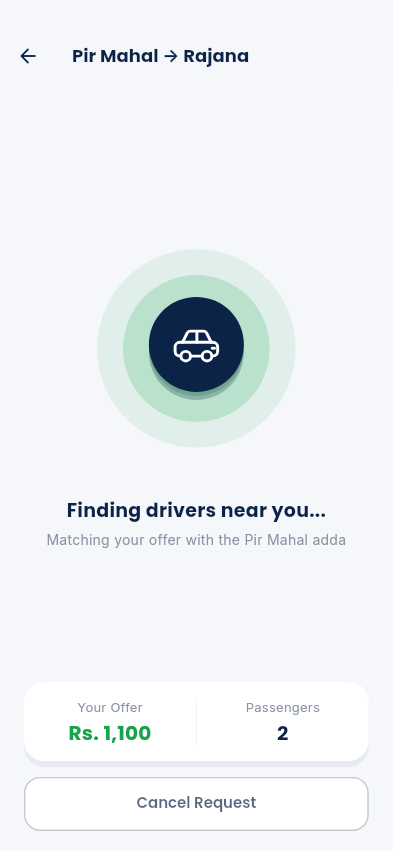
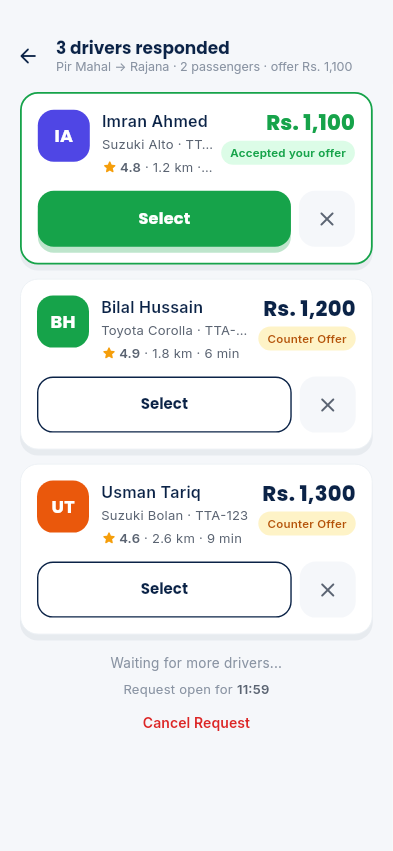
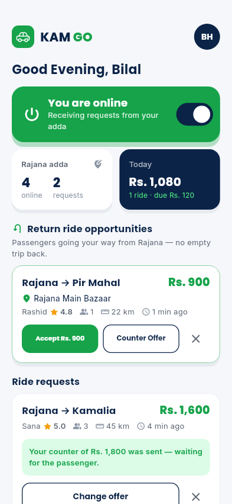

# KAM GO — Apni Ride, Apna Fare

A digital "travel adda" for Kamalia, Pir Mahal and Rajana. The passenger
offers a fare; approved, online drivers at that city's adda accept it or send
a counter offer; the passenger picks a driver. Rides are paid in cash, and KAM
GO's 10% commission is tracked in a ledger — calculated only by the server,
only on completed rides.

> Passenger chooses the ride. Driver chooses the fare. KAM GO connects both.

Flutter (Android app + web admin panel) · Riverpod · go_router · Supabase
(Postgres, Auth, Realtime, Storage, Edge Functions) · flutter_map / OpenStreetMap.

| Home | Finding drivers | Live offers | Driver dashboard |
|---|---|---|---|
|  |  |  |  |

**Highlights**
- Fare negotiation in real time: drivers accept or counter, offers slide in live (Supabase Realtime)
- Exactly one driver can win: `select_offer` locks the request row, then the offer
- Money is server-side only: commission and ledger are written by `SECURITY DEFINER` Postgres
  functions; clients have no write grant on rides, offers or payments, and RLS is on every table
- Built for budget phones on weak networks: offline cache, reconnect + refetch, no optimistic money
- English and Urdu (RTL), driver onboarding with document upload, admin web panel
- 30 unit tests, golden screenshot tests, and a 35-check acceptance test against the real backend

## What's in it

| Phase | Scope | Status |
|---|---|---|
| 1 | Theme, phone-OTP auth, roles, full schema + RLS + seed, Splash + Home | Done |
| 2 | Ride request → only matching drivers see it → accept / counter → live offers | Done |
| 3 | Select driver (row-locked), ride lifecycle, live map + moving car, server-side commission & ledger, ratings | Done |
| 4 | Driver registration + document upload, admin approval, online toggle, adda counts, return rides | Done |
| 5 | Push (FCM, optional), in-app alerts, cancellations, support, weak-network handling, Urdu toggle, admin web | Done |

**Passenger:** Home → Find a Ride → "Request sent" ✓ → Finding Drivers (radar)
→ Driver Offers (cards slide in live) → Select → Ride screen (map, Call /
Message / Share Trip / Cancel) → Ride Completed (rate 1–5) → My Rides.

**Driver:** register (CNIC, vehicle, routes, 6 photos) → admin approves →
Online toggle → live request list (Accept Rs. X / Counter / Reject) → selected
→ On my way → Start → Complete (shows fare / commission / earning) → Return
ride opportunities in the drop-off city → Earnings tab (today / week / 30 days,
commission due, ratings, history). GPS is sent every ~12 s **only during an
active ride** (Android foreground notification).

**Admin (web):** Dashboard totals, Drivers (approve / reject / suspend, view
documents via signed URLs, record commission cash), Passengers (suspend),
Cities, Routes (+ stops), Rides (filters + Final Fare / KAM GO / Driver
breakdown, admin cancel), Complaints, Settings (commission %, expiries, fare
guardrails, cancellation fee).

## Prerequisites (already installed on this machine)

- Flutter 3.47 — `export PATH="$HOME/development/flutter/bin:$PATH"`
- Android SDK — `~/development/android-sdk` (configured in Flutter)
- Supabase CLI — `~/development/supabase-cli/supabase` (needs Docker)

## Run locally

```bash
cd ~/Kamalia/kamgo_app
alias supabase=~/development/supabase-cli/supabase

# 1. Local Supabase: Postgres, Auth, REST, Realtime, Storage (+ migrations + seed)
supabase start -x studio,imgproxy,edge-runtime,logflare,vector,supavisor,mailpit,postgres-meta
supabase db reset          # any time you want a clean, freshly seeded database

# 2. App config
cp .env.example .env       # then set SUPABASE_URL + SUPABASE_PUBLISHABLE_KEY
#   Chrome:            SUPABASE_URL=http://127.0.0.1:54321
#   Android emulator:  SUPABASE_URL=http://10.0.2.2:54321
#   Key: the "Publishable" key printed by `supabase status`

# 3. Run
flutter run -d chrome --dart-define-from-file=.env                       # passenger/driver app
flutter run -d chrome -t lib/main_admin.dart --dart-define-from-file=.env # admin panel
flutter run --dart-define-from-file=.env                                 # Android emulator
```

For a real phone, use a hosted Supabase project (below) so the phone can reach it.

Tip: open two Chrome windows (one passenger, one driver) to watch offers and
ride updates arrive live.

## Demo accounts (OTP `123456` for every number)

| Phone | Who | State |
|---|---|---|
| 0300 0000001 | KAM GO Admin | admin panel |
| 0300 0000002 | Ali Raza (passenger, Pir Mahal) | 2 completed rides |
| 0300 0000003 | Sana Bibi (passenger) | open request Pir Mahal → Kamalia with 2 offers |
| 0300 0000011 | Driver A — Imran Ahmed | APPROVED, online, Pir Mahal |
| 0300 0000012 | Driver B — Bilal Hussain | APPROVED, online, Pir Mahal |
| 0300 0000013 | Driver C — Usman Tariq | APPROVED, online, Pir Mahal |
| 0300 0000014 | Driver D — Kashif Mehmood | APPROVED, **offline**, Kamalia |
| 0300 0000015 | Driver E — Naveed Akhtar | **PENDING**, Rajana |
| 0300 0000098, 0300 0000099 | — | fresh numbers for trying sign-up |

## Hosted Supabase (free tier)

1. Create a project at supabase.com.
2. `supabase link --project-ref <ref>` then `supabase db push` (applies `supabase/migrations/*`).
3. SQL editor → run `supabase/seed.sql` (demo data; skip for a real launch, but keep the cities/routes part).
4. Authentication → Sign In / Providers → **Phone**: enable. Supabase asks for an
   SMS provider even for test numbers; placeholder Twilio values are fine for
   the MVP. Add test numbers: `923000000001=123456,923000000002=123456,…`.
5. Database → Extensions: `pg_cron` is used by the migration to expire stale
   requests every minute (already enabled on Supabase).
6. `.env`: project URL + **publishable** key.

Real SMS / WhatsApp OTP later: implement `AuthService`
(`lib/features/auth/domain/auth_service.dart`); no screen changes needed.

## Push notifications (optional)

Without Firebase the app works fully: alerts arrive in-app via Realtime and
slide down from the top. To add real push:

1. Create a Firebase project, add an Android app with package `pk.kamgo.kamgo_app`.
2. Put `FIREBASE_API_KEY / APP_ID / SENDER_ID / PROJECT_ID` in `.env`
   (no `google-services.json` needed).
3. Deploy the function and its secrets:
   ```bash
   supabase functions deploy push --no-verify-jwt
   supabase secrets set FIREBASE_SERVICE_ACCOUNT="$(cat service-account.json | tr -d '\n')" \
                        PUSH_WEBHOOK_SECRET=<random string>
   ```
4. Database → Webhooks → new webhook on `public.notifications` **INSERT** →
   Supabase Edge Function `push`, header `x-webhook-secret: <same string>`.

## Build

```bash
# Android (budget phones: use the armeabi-v7a APK)
flutter build apk --release --split-per-abi --obfuscate \
  --split-debug-info=build/symbols --dart-define-from-file=.env
# Admin panel
flutter build web -t lib/main_admin.dart --dart-define-from-file=.env --output build/admin
```

Release signing isn't set up yet (APKs are signed with the debug key — fine for
testing, not for the Play Store). Add a keystore in `android/app/build.gradle.kts`
before publishing.

## Tests

```bash
flutter test --exclude-tags golden        # 30 unit tests: fares, commission, state machine, routing, models
flutter test test/goldens                 # screenshots of Home, Splash, Finding, Offers, Driver dashboard
supabase db reset && SUPABASE=~/development/supabase-cli/supabase tools/acceptance_test.sh
                                          # Section 21 acceptance test against the real backend (35 checks)
dart run tools/realtime_check.dart <publishable-key>
                                          # live Realtime events + RLS (offers, alerts, selection, GPS)
```

## Architecture

```
lib/
  core/           theme, router, l10n (EN/UR), services (location, routing,
                  map provider, connectivity, push, SOS stub), shared widgets
  features/
    auth/         AuthService interface + Supabase impl; splash, login, OTP
    profile/      onboarding, profile tab (language, emergency contact)
    passenger/    home, booking sheets, finding drivers, driver offers
    rides/        catalog (cached offline), fare policy, commission, status
                  machine, ride repository, ride screen, live map, completion
    driver/       dashboard, request cards, counter sheet, earnings, registration
    notifications/ in-app alerts
    support/      FAQ, contact, reports
    admin/        web panel (entry point: lib/main_admin.dart)
supabase/
  migrations/     01 schema · 02 helpers/RLS helpers · 03 RLS · 04 ride flow · 05 drivers/admin/storage
  functions/push  FCM sender (Database Webhook)
  seed.sql        cities, routes, demo users, rides, commissions
tools/acceptance_test.sh
```

**Server is the source of truth.** Every status change and every rupee is
handled in `SECURITY DEFINER` Postgres functions that check the caller:
`create_ride_request`, `submit_offer`, `select_offer` (locks the request row,
then the offer — exactly one selection can win), `update_ride_status` (checked
against the `ride_status_transitions` table), `complete_ride` (computes
commission + earning and writes the ledger), `cancel_ride`, `rate_ride`, and
the admin functions. Clients have **no write grant** on rides, offers,
requests, commissions, ledger, payments, drivers or roles. RLS is on for every
table and `anon` has no access. Drivers only ever see open requests in their
own city, on their preferred routes, while APPROVED and online.

**Weak networks.** Cities/routes/settings are cached on the device; every live
screen uses Realtime plus slow polling and refetches after reconnecting; an
amber "Connection lost" strip appears when offline; money and status are never
shown optimistically.

## Assumptions and choices

- **Fares** are per ride, not per seat. Guardrails Rs. 20–100 per km
  (`settings`), so Pir Mahal → Rajana (22 km) allows Rs. 440–2,200.
- **City coordinates / distances** in the seed are approximate — edit them in
  the admin panel.
- **`EXPIRED`** was added to the status list for requests nobody answered.
- **One live request per passenger**; a driver's new offer on the same request
  replaces their previous one (the fare animates on the passenger's screen).
- **Animations** are hand-built (radar rings, bobbing car, drawn check mark,
  moving car) instead of Lottie files: no licensing questions, smaller APK,
  smoother on 2 GB phones. All respect the OS "remove animations" setting.
- **Fonts** (Poppins, Inter — SIL OFL) are bundled in `assets/fonts/`, not
  fetched at runtime by `google_fonts`.
- **permission_handler** was dropped: geolocator and firebase_messaging request
  their own permissions, and the package's current release needs an Android
  SDK level that isn't available yet.
- **Chat** is via the phone's SMS app ("Message" button) rather than an in-app
  chat table — the spec marked chat as a nice-to-have.
- **Urdu**: the toggle (Profile → Language) switches the app to RTL and
  translates navigation and the main passenger/driver screens; forms, admin
  and some secondary text are still English.
- **Maps** use the public OSM tile server, which is for development only.
  Production needs a tile provider or self-hosted tiles (`TILE_URL`), with the
  app's User-Agent (already set to `pk.kamgo.kamgo_app`).
- **SOS** is a stub (`SosService`) for a later phase.
